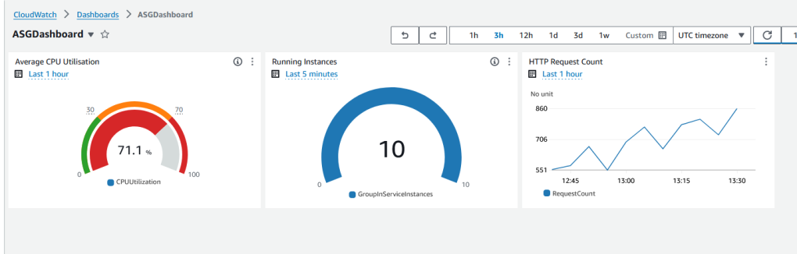

# AWS EC2 auto-scaling in response to load

This project demonstrates how to create auto-scaling infrastructure in AWS using CloudFormation and load test it using Locust.

## Scripts Explained

- `create_lb_ec2.yaml`: This is an AWS CloudFormation Template that creates an application load balancer, target group, EC2 instances and security groups.
- `app.py`: A simple Flask app that runs CPU-intensive work to trigger auto-scaling in EC2.
- `Dockerfile`: The Docker file used to run the flask server.
- `locustfile.py`: Locust load tests.

## Detailed Blog Post

For a detailed write-up, see my blog post that includes information on how to create a monitoring dashboard to monitor the Load Balancer and Auto-Scaling Group [here](https://vuyisile.com/creating-an-aws-auto-scaling-architecture-with-a-monitoring-dashboard/).

