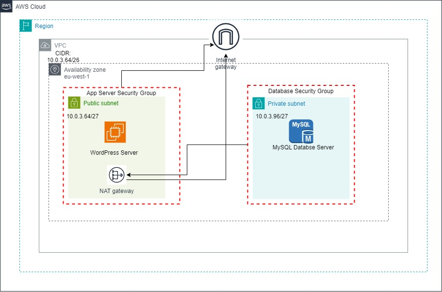

# Two Tier WordPress Architecture on AWS

This repository provides a CloudFormation template and shell scripts to create a two-tier WordPress architecture on AWS.

## Manual Setup

To manually create the architecture in the AWS Management Console, follow these steps:

1. Create a VPC with two subnets; a public and private subnet.
2. Attach an Internet Gateway to the VPC, and create a route in the Public subnet to route outbound traffic through the Internet Gateway.
3. Create a NAT Gateway or NAT instance in the public subnet. Create a route in the private subnet to allow outbound traffic(for software updates) through the NAT Gateway. 
4. Launch an EC2 instance for WordPress in the Public Subnet using the Amazon Linux 2023 AMI.
5. Configure the WordPress instance with the necessary dependencies and settings using the `install_wordpress.sh` script provided.
6. Launch a second EC2 instance for the MySQL database server in the private subnet using the Amazon Linux 2023 AMI.
7. Configure the database server instance with the necessary settings using the `install_mysql_server.sh` script provided.
8. Change and secure the root database password in both instances.

## CloudFormation Deployment

To set up the architecture using CloudFormation, follow these steps:

1. Open the AWS Management Console and navigate to the CloudFormation service.
2. Click on "Create stack" and select "Upload a template file".
3. Choose the CloudFormation template provided in this repository.
4. Fill in the required parameters, such as VPC subnets and database credentials.
5. Click on "Create stack" to start the deployment process.

For more detailed instructions and information, please refer to the [CloudFormation documentation](https://docs.aws.amazon.com/cloudformation/).

## Folder Structure

- `CloudFormation/`: Contains the CloudFormation template to create the entire infrastructure stack.
- `Scripts/`: Contains the shell scripts for configuring the EC2 instances.

## License

This project is licensed under the [MIT License](LICENSE).
